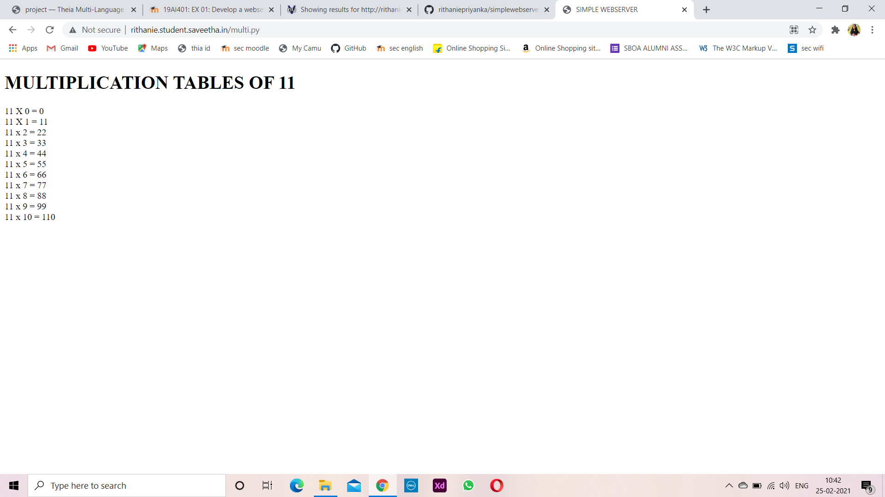
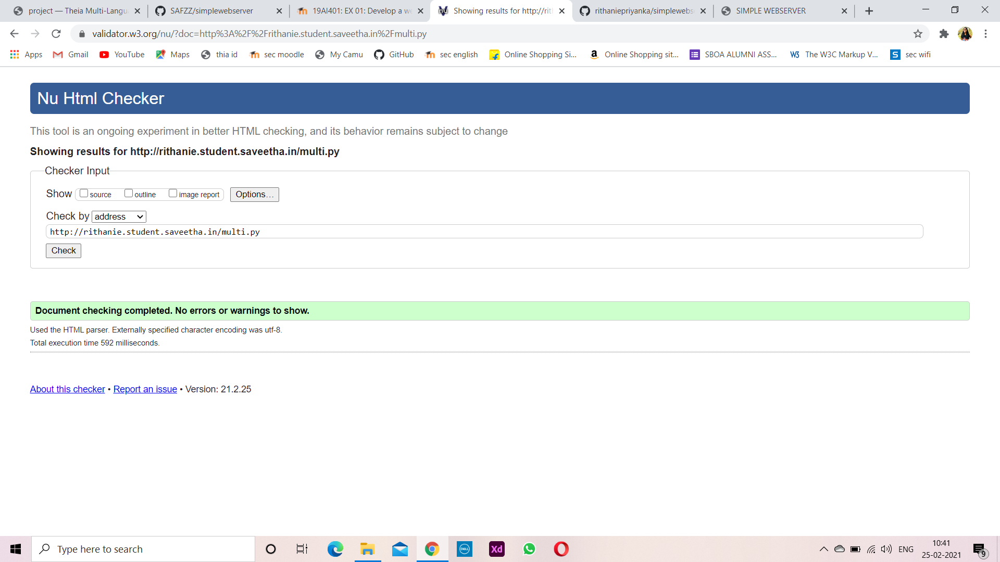

# Developing a Simple Webserver
## AIM:
To develop a simple webserver to serve html pages.

## DESIGN STEPS:
### Step 1: 
HTML content creation
### Step 2:
Design of webserver workflow
### Step 3:
Implementation using Python code
### Step 4:
Serving the HTML pages.
### Step 5:
Testing the webserver

## PROGRAM:
```
from http.server import HTTPServer,BaseHTTPRequestHandler
content = """
<!DOCTYPE html>
<html lang=en>
<head>
<title>SIMPLE WEBSERVER</title>
</head>
<body>
<h1>MULTIPLICATION TABLES OF 11</h1>
11 X 0 = 0<br>
11 X 1 = 11<br>
11 x 2 = 22<br>
11 x 3 = 33<br>
11 x 4 = 44<br>
11 x 5 = 55<br>
11 x 6 = 66<br>
11 x 7 = 77<br>
11 x 8 = 88<br>
11 x 9 = 99<br>
11 x 10 = 110<br>
</body>
</html>
"""
class myhandler(BaseHTTPRequestHandler):
    def do_GET(self):
        print("request received")
        self.send_response(200)
        self.send_header('content-type', 'text/html; charset=utf-8')
        self.end_headers()
        self.wfile.write(content.encode())
server_address = ('',80)
httpd = HTTPServer(server_address,myhandler)
print("my webserver is running...")     
httpd.serve_forever()
```


## OUTPUT:



## RESULT:
Thus a website is designed for the simple webserver and is hosted in the 
URL: http://rithanie.student.saveetha.in/multi.py. HTML code is validated.